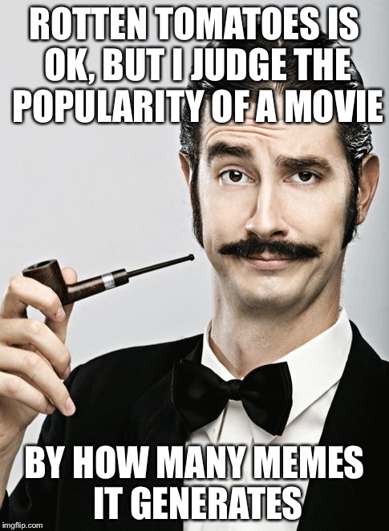
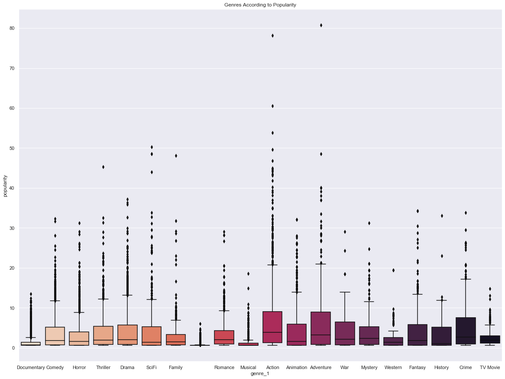
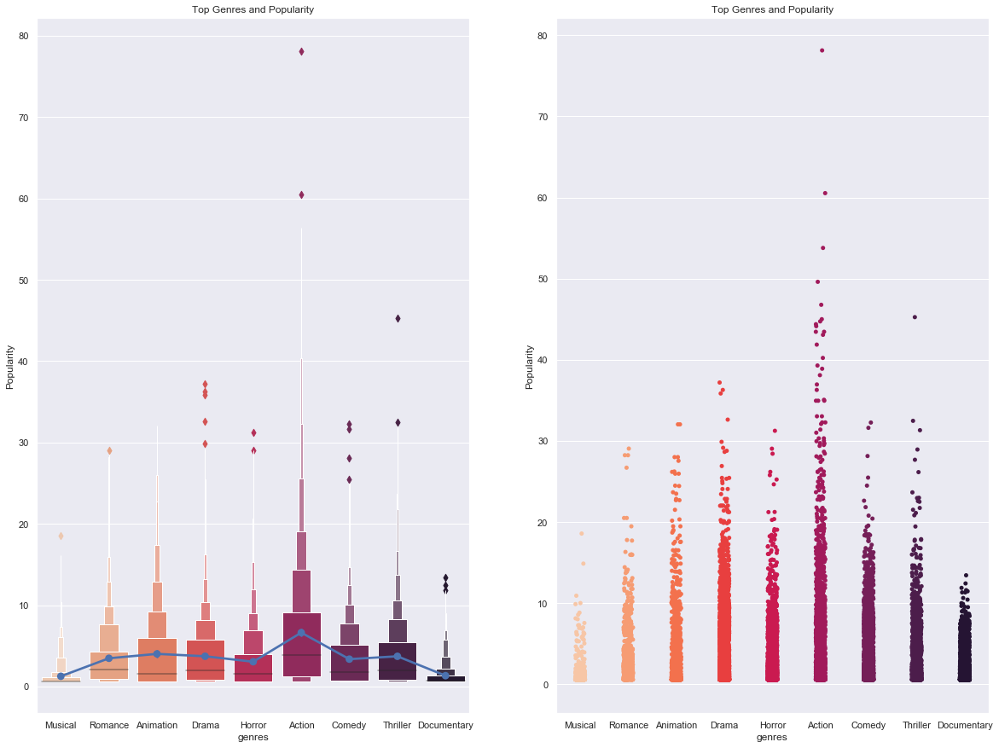
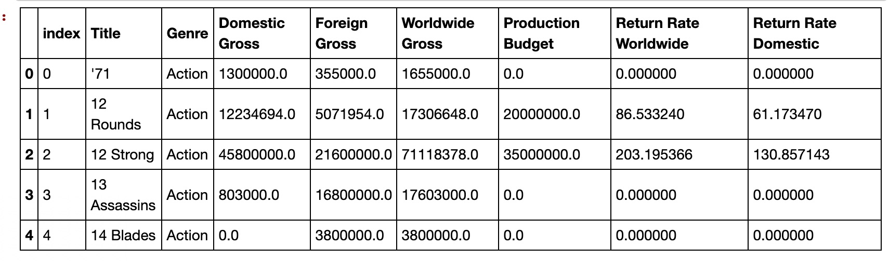
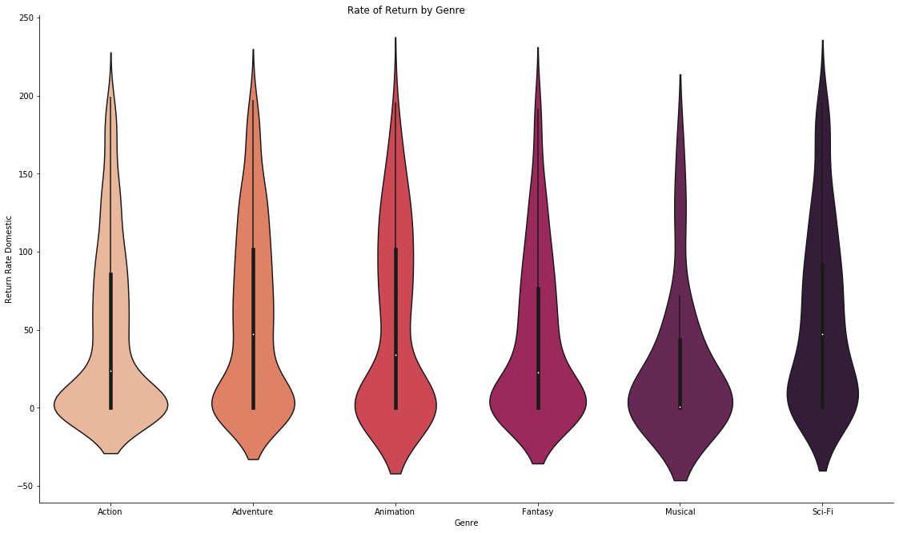
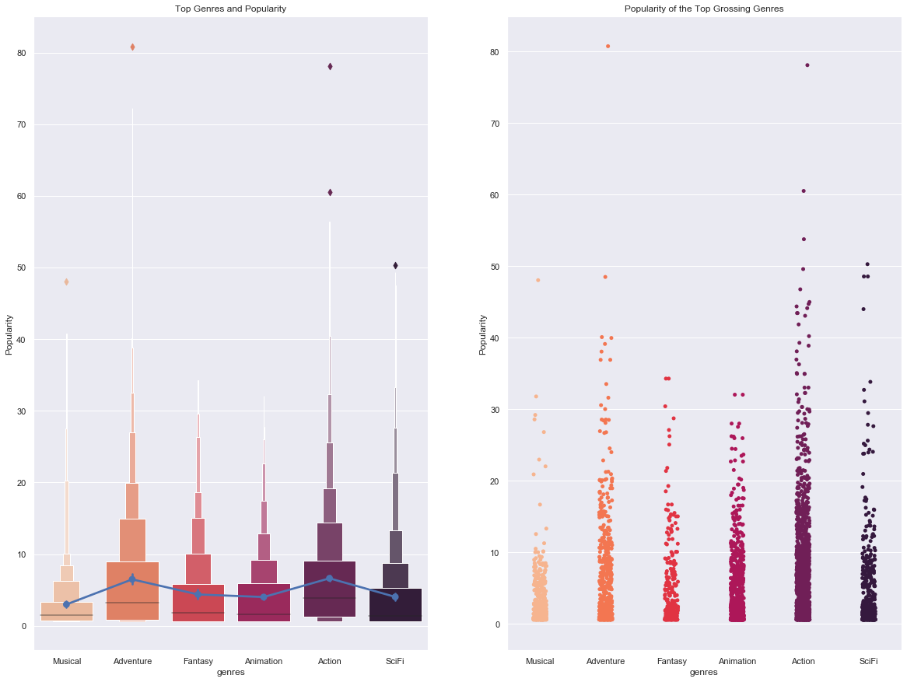
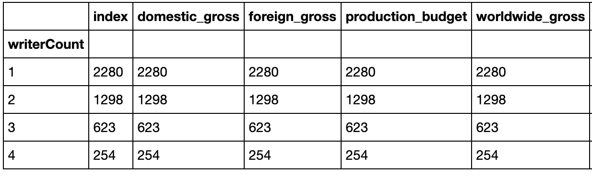
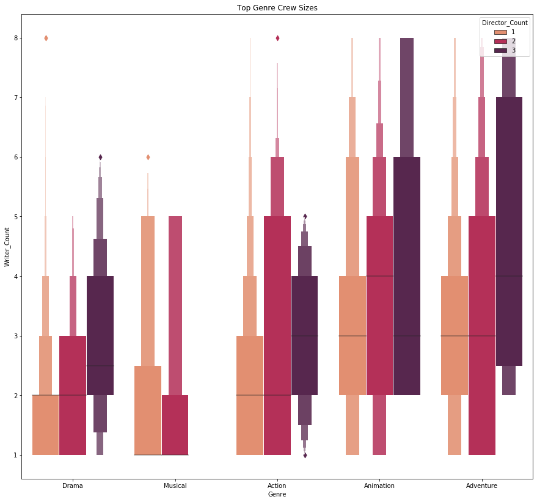
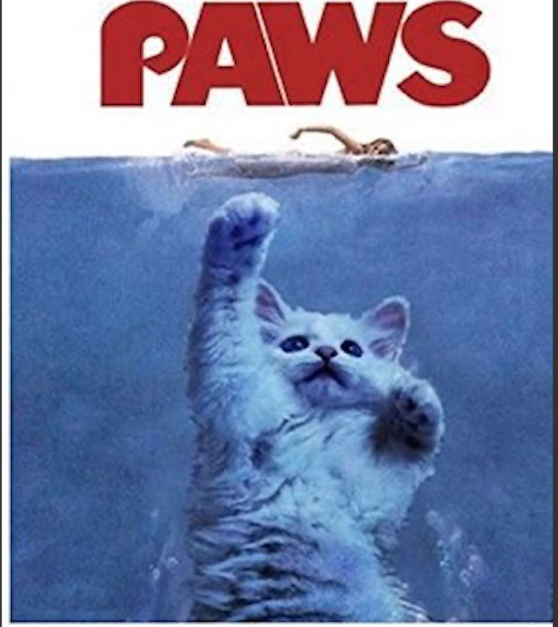

# Exploration into Microsoft Movie Studio

A data analysis project by: Leighanna Hooper, Payson Chadrow and Kaila Kay

Table of Contents:

- Purpose
- Data Description
- Question 1
- Question 2
- Question 3
- Recommendations
- Future Work

## Purpose
Microsoft has decided to get into show business!  This project's purpose is to help them better understand the movie industry. Using some data sets, this project will give a prelimanlary analysis of the types of films that are currently doing the best at the box office. 

Data Description:

- bom.movie_gross.csv
- imdb.name.basics.csv
- imdb.title.akas.csv
- imdb.title.basics.csv
- imdb.title.principals.csv
- imdb.title.ratings.csv.gz
- rt.movie_info.tsv.gz
- rt.reviews.tsv.gz
- tmdb.movies.csv
- tn.movie_budgets.csv 

## Questions:

What are the top genres in terms of popularity?

For this question we used TheMovieDB data set.  After cleaning, we realized that the IDs were numerical and did have the genre type associsted with each ID.

Utilizing TheMovieDB's developer site, we were able to extract genre ID keys and pair them with genre names by utilizing an API key to pull in the description information.

TheMovieDB has its own formula for calculating popularity that includes factors such as daily views and votes, the number of times a movie was favorited, and the release date - among others.

We plotted our genres according to their popularity using a box plot that shows the quartiles of the dataset while the whiskers extend to show the rest of the distribution. The diamond points outside of the distribution show the outliers for that particular genre. This uses the inter-quartile range function.

Conclusion: In terms of popularity, the Action, Animation, Drama, Thriller and Comedy genres stand out the most.  While these are not a guaranteed good investment, it is probably safe to assume that any film made in these genres would be popular.

From here we linked our financial data.
 

<a href="Question 1 - Top Genres in Terms of Popularity.ipynb">Question 1 Notebook</a>
<a href="https://developers.themoviedb.org/3/getting-started/popularity"> TheMovieDB's popularity criteria.</a>
<a href="TMDB_Data_Cleaning.ipynb">Question 1 Data Cleaning</a>

What are the top performing genres financially?

After cleaning and breaking down both the IMDB and also the BOM data sets by genre, and taking the mean production budgets, we calculated the Return of Investment per movie based off of the financial information that we were provided.

We took our top grossing genres, Musical, Animation, Adventure, Fantasy, Action and SciFi to show the ROI more clearly.

We linked our top performing genres with popularity ratings as well.

Conclusion:
We see that the Action genre has high popularity and ROI of 116%. With access to larger budgets, the studio will benefit from debuting with an Action genre movie.

<a href="Question 2 - Top Genres in Terms of Finance.ipynb">Question 2 Notebook</a>
<a href="https://github.com/kailakay/dsc-mod-1-project-v2-1-onl01-dtsc-ft-041320"> Kaila Kay's Repository.</a>

What affect does the number of directors and writers play on a films total gross and budget?

Here we again used the IMDB's data sets as well as the TN Movie Budgets data set.

After cleaning the data, we were able to sort the financials based on the number of writers and directors a movie had.

We graphed our top genres in terms of writers and directors to get a better understanding.

Conclusion:
While the writer count does vary significantly with multiple directors, the majority of these genres that stuck with one director had on average 1-3 writers.

<a href="Question 3 - Finance in Terms of Directors and Writers .ipynb">Question 3 Notebook</a>
<a href="https://github.com/pchadrow/Mod1_Project"> Payson Chadrow's Repository.</a>

## Wrap Up
We recommend that Microsoft Studios focus on the Action genre due to its high popularity and ROI of 116%. With access to larger budgets, we believe that the studio will benefit immensely.

The Action genre has a mean production budget of around 46.5 million dollars, with a mean gross of over 54 million dollars. A well developed Action genre movie will allow the  studio to cover the costs of a second movie, looking in the Adventure or Animation genre, which are both financially successful as well as having high popularity ratings.

It is also recommended that thier first Action genre film be limited to 1 director, with 2-3 writers.

Future Work:

- Create a larger dataset in order to gain more acurate insight
- Investigate if popularity is skewed by voter tendencies
- Look into release date and run-time on popularity and profitability
- Whether or not high profile individuals have an effect on profit
- Compare studio competition to optimize niche markets

